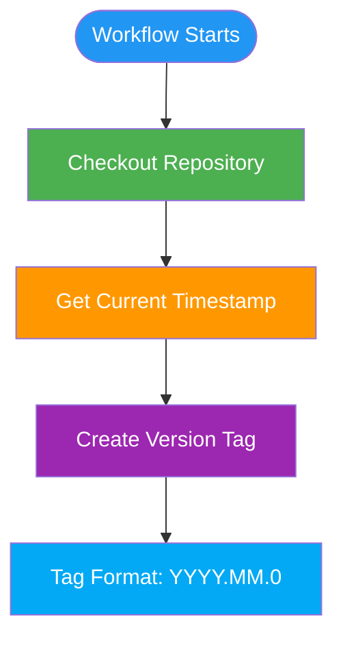

# Google Summer of Code 2025 – Contributions to Mifos Initiative
This repository documents my work during Google Summer of Code 2025 with the [Mifos Initiative](https://github.com/openMF), as well as my contributions before the official coding period.

My GSoC project focused on **Making the Mobile Wallet Deployment-Ready for G2P and Merchant Use Cases**, but my work extended across multiple repositories to enhance functionality, fix bugs, improve CI/CD, and contribute to the Kotlin Multiplatform ecosystem within Mifos.

<kbd>Table of contents</kbd>

#### TOC
- [✨ Projects and Contributions](#multi-platform-app-build-and-publish-workflow)
  - [openMF/mobile-wallet](#workflow-usage-example)
  - [openMF/Mifos-mobile](#workflow-usage-example)
  - [openMF/kmp-project-template](#workflow-usage-example)
  - [openMF/android-client](#workflow-usage-example)
  - [openMF/mifos-passcode-cmp](#workflow-usage-example)
- [✨ Kotlin/JS Web Application GitHub Pages Deployment Workflow](#kotlinjs-web-application-github-pages-deployment-workflow)
  - [Workflow Configuration](#workflow-configuration)
- [✨ Monthly Version Tagging Workflow](#monthly-version-tagging-workflow)
  - [Workflow Configuration](#workflow-configuration-1)
- [✨ PR Check Workflow](#pr-check-workflow)
  - [Workflow Usage Example](#workflow-usage-example-1)
- [✨ Promote Release to Play Store Workflow](#promote-release-to-play-store-workflow)
  - [Configuration Steps](#configuration-steps)

####

# Projects and Contributions
1. openMF/mobile-wallet
A Kotlin Multiplatform (KMP) reference implementation of a digital wallet built on Apache Fineract. It supports Android, iOS, desktop, and web platforms using Compose Multiplatform, Ktor/Ktorfit, and Koin to deliver a clean architecture-based wallet with payment capabilities. Developed for both client and merchant use cases, this wallet is optimized for financial inclusion scenarios and aligned with open digital finance frameworks.

| No          | PR No                           | Description                                                                  | PreGsoc/Gsoc | Required |
|-------------------|------------------------------------|------------------------------------------------------------------------------|-----------------|----------|
| Android           | `ORIGINAL_KEYSTORE_FILE`           | Base64 encoded release keystore                                              | Base64          | Yes      |
| Android           | `ORIGINAL_KEYSTORE_FILE_PASSWORD`  | Keystore password                                                            | String          | Yes      |
| Android           | `ORIGINAL_KEYSTORE_ALIAS`          | Keystore alias                                                               | String          | Yes      |
| Android           | `ORIGINAL_KEYSTORE_ALIAS_PASSWORD` | Keystore alias password                                                      | String          | Yes      |
|                   |                                    |                                                                              |                 |          |
| Android           | `UPLOAD_KEYSTORE_FILE`             | Base64 encoded release keystore for upload                                   | Base64          | Yes      |
| Android           | `UPLOAD_KEYSTORE_FILE_PASSWORD`    | Upload keystore password                                                     | String          | Yes      |
| Android           | `UPLOAD_KEYSTORE_ALIAS`            | Upload keystore alias                                                        | String          | Yes      |
| Android           | `UPLOAD_KEYSTORE_ALIAS_PASSWORD`   | Upload keystore alias password                                               | String          | Yes      |
|                   |                                    |                                                                              |                 |          |
| Google Services   | `GOOGLESERVICES`                   | Google Services JSON content                                                 | Base64          | Yes      |
| Play Console      | `PLAYSTORECREDS`                   | Play Store service account credentials                                       | Base64          | Yes      |
| Firebase          | `FIREBASECREDS`                    | Firebase App Distribution credentials                                        | Base64          | Yes      |
|                   |                                    |                                                                              |                 |          |
| iOS               | `NOTARIZATION_APPLE_ID`            | Apple ID for app notarization                                                | String          | Yes      |
| iOS               | `NOTARIZATION_PASSWORD`            | Password for notarization process                                            | String          | Yes      |

3. openMF/Mifos-mobile
The official native Android application for end-user clients built on the MifosX/Fineract self-service platform. Written in Kotlin, it allows customers to view and manage their savings, loans, and transactions securely. The app provides a pared-down user experience tailored to mobile clients with integration into core banking services.

4. openMF/kmp-project-template
A boilerplate template designed for Kotlin Multiplatform projects. It provides standard architecture, build configuration, and Gradle setup to boot‑strap new KMP-driven SDKs or client apps. It streamlines cross-platform development and enforces best practices for modular, Kotlin-based libraries and applications.

5. openMF/android-client
A field‑officer facing Android app that runs on top of the Mifos/Fineract backend. Originally built as a Kotlin multi-module application, it enables staff to manage portfolios, approve loans, and handle client data in remote locations. Recent efforts focus on migrating its network layer to the fineract-client-kmp-sdk and adopting Multiplatform code structure.

6. openMF/mifos-passcode-cmp
A Kotlin Multiplatform library providing secure passcode functionality for Mifos applications. It supports Android, iOS, and desktop apps and enforces passcode lock on resume or inactivity. Released under Apache 2.0, it improves app security and UX consistency across platforms.

## Kotlin Multiplatform Project Setup Guide

### Resources
- [Kotlin Multiplatform Documentation](https://kotlinlang.org/docs/multiplatform.html)
- [Compose Multiplatform Guide](https://www.jetbrains.com/lp/compose-multiplatform/)
- [Fastlane Documentation](https://docs.fastlane.tools/)

---

# Multi-Platform App Build and Publish Workflow

> \[!TIP]
>  ####  _[multi_platform_build_and_publish.yaml](.github/workflows/multi-platform-build-and-publish.yaml)_ 👀️

---

# Monthly Version Tagging Workflow

> \[!TIP]
>
> #### [_monthly-version-tag.yaml_](.github/workflows/monthly-version-tag.yaml)

---

# PR Check Workflow

> \[!TIP]
> #### [_pr_check.yml_](.github/workflows/pr-check.yaml)

---
